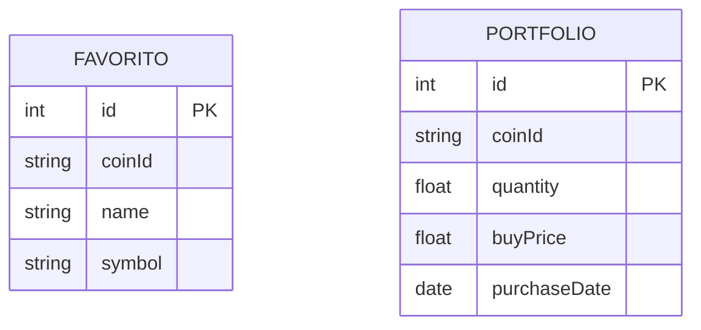

# 🛠️ Especificação Técnica - Crypto Portfolio Tracker

## 📊 Modelo de Dados

---

## 📌 Descrição das Entidades

### ⭐ FAVORITO

Armazena as criptomoedas favoritas do usuário.

* id: identificador único
* coinId: id da moeda (CoinGecko)
* name: nome da moeda
* symbol: símbolo (BTC, ETH)

---

### 💰 PORTFOLIO

Armazena os investimentos do usuário.

* id: identificador único
* coinId: id da moeda
* quantity: quantidade comprada
* buyPrice: preço de compra
* purchaseDate: data da compra

---

## 🔌 Integrações

* API pública: CoinGecko (dados de mercado)
* API fake: JSON Server (persistência de dados)

---

## ⚙️ Tecnologias

* HTML, CSS (Bootstrap)
* JavaScript
* jQuery
* JSON Server
* Web Storage
