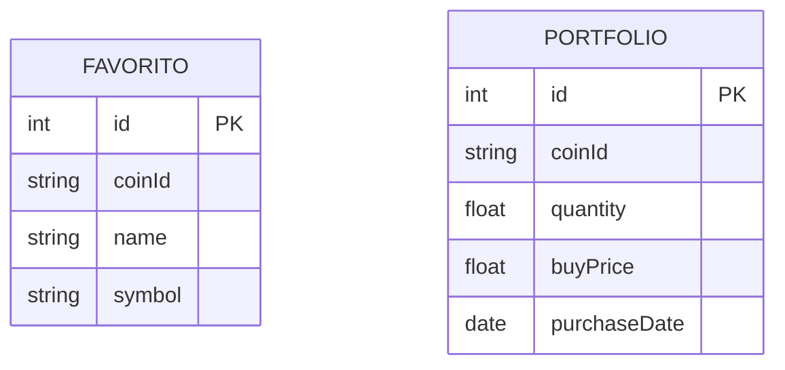

# 📄 Especificações Técnicas

## 🧩 Framework
- Bootstrap: 5.3.3

## 🌐 API
- Nome: (ex: CoinGecko API)
- Versão: v3
- URL base: https://api.coingecko.com/api/v3

## 🤖 Agentes de IA utilizados
- OpenAI GPT (ChatGPT)
  - Uso: geração de código, explicações e apoio no desenvolvimento
  - Modelo: GPT-5.3

- Stitch (ou ferramenta que você usou)
  - Uso: (ex: geração de layout, integração visual, automações)
  - Observação: ferramenta utilizada como apoio no design/desenvolvimento

## 🛠️ Linguagens
- HTML5
- CSS3
- JavaScript (ES6+)

## 📦 Dependências
- Bootstrap CDN:
https://cdn.jsdelivr.net/npm/bootstrap@5.3.3/dist/css/bootstrap.min.css

## 🎯 Objetivo técnico
Definir padrões claros de desenvolvimento, incluindo uso de IA como apoio, garantindo consistência, rastreabilidade e escalabilidade do projeto.
# 🛠️ Especificação Técnica - Crypto Portfolio Tracker

## 📊 Modelo de Dados

---

## 📌 Descrição das Entidades

### ⭐ FAVORITO

Armazena as criptomoedas favoritas do usuário.

* id: identificador único
* coinId: id da moeda (CoinGecko)
* name: nome da moeda
* symbol: símbolo (BTC, ETH)

---

### 💰 PORTFOLIO

Armazena os investimentos do usuário.

* id: identificador único
* coinId: id da moeda
* quantity: quantidade comprada
* buyPrice: preço de compra
* purchaseDate: data da compra

---

## 🔌 Integrações

* API pública: CoinGecko (dados de mercado)
* API fake: JSON Server (persistência de dados)

---

## ⚙️ Tecnologias

* HTML, CSS (Bootstrap)
* JavaScript
* jQuery
* JSON Server
* Web Storage
